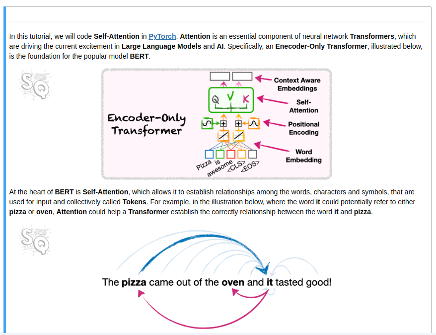

# Attention in Transformers: Concepts and Code in PyTorch:

<a href="https://www.deeplearning.ai/short-courses/attention-in-transformers-concepts-and-code-in-pytorch/" target="_blank">Link</a>

## Attention and Self-Attention:

## Masked Self-Attention:

## Encoder Decoder Attention: 

 

## Multi-Head Attention:

